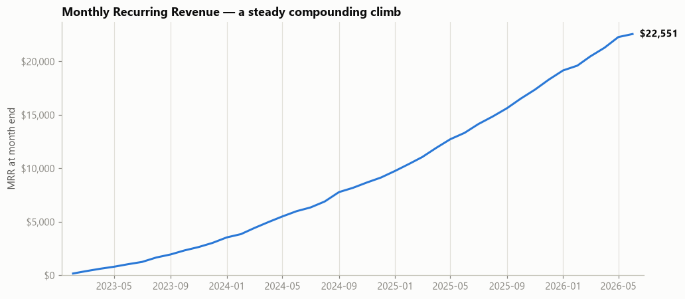
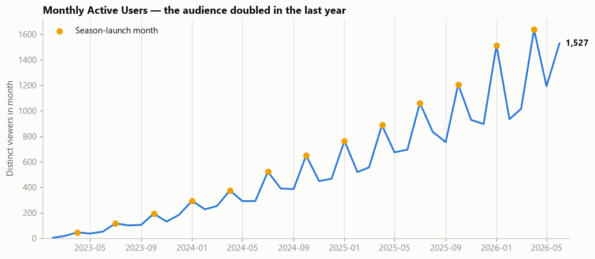
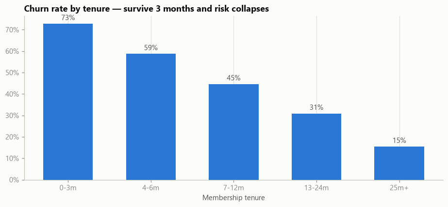
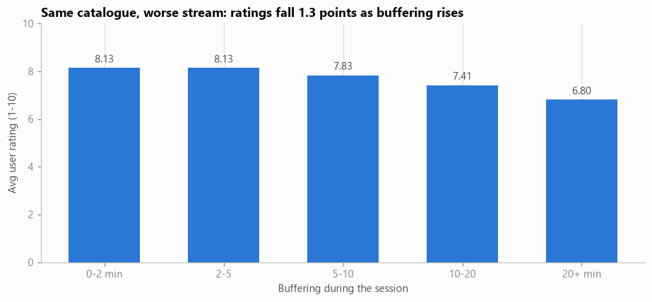
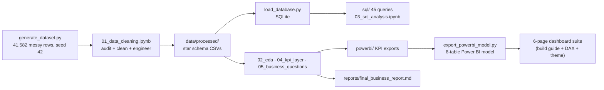

# Anime Streaming Platform Analytics

*End-to-end Data Analyst portfolio project: from a deliberately messy 41.5k-row export
to governed KPIs, 31 answered business questions, a Power BI dashboard package, and an
executive report — for a fictional anime streaming platform.*

**Stack:** Python (pandas, NumPy, matplotlib/seaborn) · SQL (SQLite, window functions) ·
Power BI (star schema, DAX) · Jupyter

| The job an analyst does | Where it happens here |
|---|---|
| Clean production-grade messy data, document every decision | [`notebooks/01_data_cleaning.ipynb`](notebooks/01_data_cleaning.ipynb) · [`docs/cleaning_log.md`](docs/cleaning_log.md) |
| Explore and visualize | [`notebooks/02_eda.ipynb`](notebooks/02_eda.ipynb) — 17 charts, consistent design system |
| Query a warehouse | [`sql/`](sql/) — 45 annotated queries, GROUP BY → CTEs → window functions |
| Define metrics people can trust | [`docs/kpi_definitions.md`](docs/kpi_definitions.md) — 25 KPIs, one formula each |
| Answer real business questions | [`notebooks/05_business_questions.ipynb`](notebooks/05_business_questions.ipynb) — 31 × Analysis → Insight → Recommendation |
| Build the BI layer | [`powerbi/`](powerbi/) — model export, DAX for every KPI, 6-page dashboard build guide |
| Tell leadership what to do | [`reports/final_business_report.md`](reports/final_business_report.md) |

---

## The business problem

A Crunchyroll-style streaming platform is growing fast — **MRR +70% YoY, MAU +120%** —
but leaking fast: **~7% of subscribers cancel every month**, and the product hasn't
turned visits into habits (users watch ~1.2 days/month). Leadership needs to know:

1. What is the true state of the business? *(one set of numbers everyone agrees on)*
2. Who are our users and how do they actually behave?
3. Why do subscribers churn — and what would have kept them?
4. Where should the next dollar of content, marketing and engineering budget go?

## Headline findings

<p align="center">
  
  
</p>

- **Growth is rented, not owned.** Audiences arrive on season launches (+34% MAU in
  launch months) and recede; depth per viewer has been flat for three years while reach
  doubled.
- **Churn has a shape**: 59% of it happens in the first 3 months — and early churners
  aren't no-shows (75% watch in month one); their sessions are just worse.
- **The experience taxes the catalogue**: identical content loses **1.3 rating points**
  when buffering exceeds 20 minutes — and it's the *network* (satellite/mobile data),
  not the device. Mobile is 51% of viewing with the worst completion (56% vs 70% on TV).
- **Behaviour beats demographics for retention**: users who ever watchlist churn at 41%
  vs 66%; one 3-episode binge day → 29% vs 61%. Meanwhile churned users watched the
  *same genres* as loyalists — the "churn genre" theory is dead on arrival.
- **Revenue is a loyalty business**: the top 10% of users fund 51.6% of lifetime
  revenue; Shonen alone carries 50.3% of watch hours.
- **The sized prize**: converting half of paid early churners into ordinary churners is
  worth **≈ $43.8k — 11.7% of all revenue collected to date**.

<p align="center">
  
  
</p>

Full analysis: [`reports/final_business_report.md`](reports/final_business_report.md) —
every figure machine-verified against the governed KPI layer.

## Architecture



**Metric governance:** every number exists in three independent implementations —
pandas, SQL, and DAX — all bound to the single formula in
[`docs/kpi_definitions.md`](docs/kpi_definitions.md), and machine-verified to agree to
the cent (`notebooks/04_kpi_layer.ipynb`, validation section).

## The dataset (synthetic, on purpose)

Generated with persona-driven business rules — tenure-dependent churn hazard, plan
economics, QoS effects on satisfaction, weekend/prime-time seasonality, Zipf-like title
popularity — then **deliberately degraded** with documented, seeded data-quality issues
(duplicates, mixed date formats, numerics-as-text, impossible values, inconsistent
category labels, missing data). The cleaning notebook verifies its recovery against the
generator's injection report — so the cleaning is *graded*, not just performed.

7,993 users · 64 titles · 41,046 watch events · Jan 2023 – Jun 2026 ·
[`docs/data_dictionary.md`](docs/data_dictionary.md) documents all 41 raw columns.

## Repository layout

```
├── scripts/
│   ├── generate_dataset.py        # seeded synthetic data generator (messy raw CSV)
│   ├── validate_dataset.py        # 26 realism + data-quality checks on the raw file
│   ├── load_database.py           # star schema -> SQLite
│   └── export_powerbi_model.py    # 8-table Power BI model with integrity gate
├── notebooks/
│   ├── 01_data_cleaning.ipynb     # audit -> clean -> feature engineering -> star schema
│   ├── 02_eda.ipynb               # 17 charts, each followed by a written insight
│   ├── 03_sql_analysis.ipynb      # the 45 sql/ queries, run + explained
│   ├── 04_kpi_layer.ipynb         # 25 KPIs: snapshot + 42-month engine + validation
│   └── 05_business_questions.ipynb# 31 business questions, A -> I -> R format
├── sql/                           # 01 foundations · 02 joins/CTEs · 03 window fns · 04 KPIs
├── docs/                          # data dictionary · KPI definitions · cleaning log
├── powerbi/                       # KPI exports · measures.md (DAX) · theme.json · build guide
├── reports/                       # final business report + exported figures
├── data/ · database/              # generated artifacts (git-ignored, fully reproducible)
└── requirements.txt
```

## Getting started

```powershell
git clone <this-repo> && cd anime-streaming-analytics
python -m venv .venv
.\.venv\Scripts\Activate.ps1
pip install -r requirements.txt
```

**Rebuild everything from the seed** (≈2 minutes + notebook execution):

```powershell
python scripts\generate_dataset.py      # data/raw/ (41,582 rows, seed 42)
python scripts\validate_dataset.py      # 26 checks on the raw file
jupyter nbconvert --execute --inplace notebooks\01_data_cleaning.ipynb
python scripts\load_database.py         # database/anime_streaming.db
jupyter nbconvert --execute --inplace notebooks\02_eda.ipynb notebooks\03_sql_analysis.ipynb notebooks\04_kpi_layer.ipynb notebooks\05_business_questions.ipynb
python scripts\export_powerbi_model.py  # powerbi/model/ for Power BI Desktop
```

## Power BI dashboards

The [`powerbi/`](powerbi/) folder is a complete build kit: run the model export, load the
8 tables, apply [`theme.json`](powerbi/theme.json), paste the measures from
[`measures.md`](powerbi/measures.md), and follow
[`dashboard_build_guide.md`](powerbi/dashboard_build_guide.md) page by page
(relationships diagram, slicers, bookmarks, drill-through, tooltip page, acceptance
tests). Six pages: **Executive · Subscribers & Churn · Revenue · Behaviour · Content ·
Recommendations.**

**📊 See the built report: [`reports/powerbi_dashboards.pdf`](reports/powerbi_dashboards.pdf)** — all four
pages (Executive Summary · Subscriptions & Churn · Revenue & Monetization · Content & Behaviour)
exported from the `.pbix`.

## Interview Q&A this project backs up

<details>
<summary><b>“How do you make sure a dashboard number is right?”</b></summary>
One definitions document (<code>docs/kpi_definitions.md</code>), three independent
implementations (pandas / SQL / DAX), machine-verified reconciliation to the cent, and
an acceptance-test section in the dashboard guide. Disagreements become detectable bugs
instead of meetings.
</details>

<details>
<summary><b>“Tell me about a data-quality decision you had to make.”</b></summary>
36 users had status <i>Cancelled</i> but an unrecoverable end date. Status was declared
authoritative: they count in lifetime churn but are excluded from the dated monthly
engine — and the impact was priced (36 actives, ~$140 MRR) and documented rather than
silently absorbed.
</details>

<details>
<summary><b>“What's the difference between MAU and active subscribers?”</b></summary>
Contract-based vs behaviour-based counting. The gap between them is disengaged-but-paying
users — churn risk. This project keeps both and never interchanges them.
</details>

<details>
<summary><b>“How do you aggregate a monthly churn rate over a quarter?”</b></summary>
Total cancellations over total starting actives — never an average of monthly rates.
The DAX measure's comment says exactly this; the pandas engine implements the same rule.
</details>

<details>
<summary><b>“Tell me about a time the data contradicted a stakeholder's theory.”</b></summary>
Q6: churned users' genre mix differs from loyalists' by at most ±1.1pp — the "we lose
people because we lack genre X" theory has no support. Also Q11: the discovery surface
doesn't matter, but watchlist-adding cuts churn 66%→41%.
</details>

<details>
<summary><b>“Correlation vs causation — where did you draw the line?”</b></summary>
Bingers churn at 29% vs 61%, but bingers may simply be the engaged — the writeup says so
and proposes an autoplay A/B. And the naive buffering→churn quartile cut is
non-monotonic (a confound worth showing); the defensible chain is buffering → CSAT →
churn (notebook 05, Q24).
</details>

<details>
<summary><b>“Why a star schema?”</b></summary>
One wide table is fine for EDA; the star schema powers SQL joins, keeps the Power BI
model small with reusable dimensions and single filter direction, and this project ships
both — plus the gotcha that the BI date table must span full months for time
intelligence (<code>export_powerbi_model.py</code> rebuilds it on a full calendar).
</details>

<details>
<summary><b>“How would you size the impact of a recommendation?”</b></summary>
A conservative scenario with stated assumptions: converting half of the 1,331 paid early
churners into ordinary churners (10.1-month vs 1.7-month lifetimes) ≈ $43.8k — 11.7% of
all revenue collected. Every recommendation in the report competes for budget with a
number attached.
</details>

## License & attribution

[MIT](LICENSE) © 2026 R. Soundariya.

All data is synthetic (generated by `scripts/generate_dataset.py`, seed 42). Anime
titles and studio names are used nominatively as realistic catalogue labels; no real
viewer data is involved. Built as a portfolio project.
