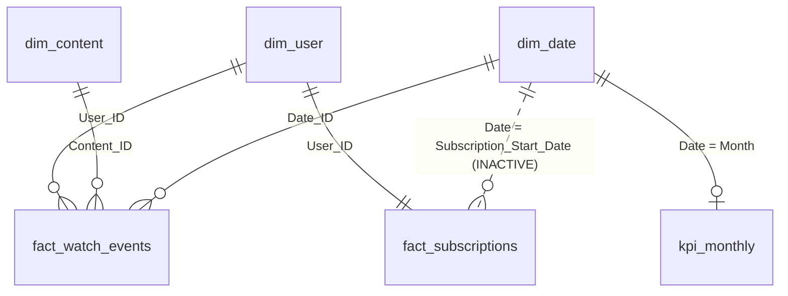

# Power BI Dashboard Build Guide — Anime Streaming Analytics

A page-by-page recipe for building the six-dashboard suite in Power BI Desktop from the
exported model. Everything referenced here already exists in this folder:

| Piece | File |
|---|---|
| Data model (8 tables) | `model/*.csv` — regenerate with `python scripts/export_powerbi_model.py` |
| DAX for every KPI | `measures.md` |
| Report theme (validated palette) | `theme.json` |
| Metric definitions (source of truth) | `../docs/kpi_definitions.md` |

Time to build: ~2–3 hours for all six pages following this guide.

---

## 1 · Load the data

1. Run `python scripts/export_powerbi_model.py` (populates `powerbi/model/`).
2. Power BI Desktop → **Get Data → Text/CSV**, import each of the 8 files in `model/`
   (or use the Folder connector pointed at `model/` and expand each file to its own query).
3. In Power Query, verify column types (dates parsed as Date/DateTime, `Date_ID` as
   whole number, `Monthly_Fee`/`Revenue`/`MRR` as decimal). Rename queries to the file
   names without `.csv`. **Close & Apply.**
4. View → Themes → **Browse for themes** → `theme.json`.

## 2 · Model the relationships

| From | To | Cardinality | Active |
|---|---|---|---|
| `fact_watch_events[User_ID]` | `dim_user[User_ID]` | many-to-one | ✔ |
| `fact_watch_events[Content_ID]` | `dim_content[Content_ID]` | many-to-one | ✔ |
| `fact_watch_events[Date_ID]` | `dim_date[Date_ID]` | many-to-one | ✔ |
| `fact_subscriptions[User_ID]` | `dim_user[User_ID]` | one-to-one | ✔ |
| `kpi_monthly[Month]` | `dim_date[Date]` | one-to-one | ✔ |
| `fact_subscriptions[Subscription_Start_Date]` | `dim_date[Date]` | many-to-one | ✘ (activated by `USERELATIONSHIP` in the acquisition measures) |

Then:
- **Mark `dim_date` as date table** (Table tools → Mark as date table → `Date`).
- Hide the standalone tables from report view except the fields used directly:
  `kpi_snapshot` is reference data (used on the Executive page table + acceptance
  testing); `kpi_by_plan` feeds plan visuals.
- Create the `_Measures` table and add every measure from `measures.md`.
- Hide raw FK columns (`User_ID`, `Content_ID`, `Date_ID`) on fact tables.

## 3 · Report-wide conventions

- **Slicer row** at the top of every page (except Recommendations): `dim_date[Date]`
  (between-style), `dim_user[Subscription_Plan]`, `dim_user[Region]`. Select all three →
  View → Sync slicers → apply to all pages so a filter follows the reader.
- **Palette discipline** (theme.json enforces order): series colors come from the theme
  in fixed order; **plans always use** Free = gray `#898781`, Basic = `#2a78d6`,
  Premium = `#4a3aa7`, Family = `#008300` (set once per visual under Data colors).
  Status/alert coloring (`good/bad`) is reserved for KPI indicators, never for series.
- **One axis per chart.** Where two measures share a visual (e.g. new vs cancelled),
  they share one scale; otherwise use two charts side by side.
- **Tooltips:** build one hidden tooltip page (below) and attach it to every trend visual.
- **Number formats** come from the measure format strings — never override per-visual.

### Tooltip page (build once, before the pages)

New page `TT Month` → Page information → *Allow use as tooltip*; canvas size Tooltip.
Add four card visuals: `[MAU]`, `[MRR (Trend)]`, `[Monthly Churn Rate]`,
`[Total Watch Hours]`, plus a text title bound to `SELECTEDVALUE(dim_date[Month_Name])`.
On each trend visual: Format → General → Tooltips → Report page → `TT Month`.

---

## Page 1 · Executive Overview

*The five-numbers-before-coffee page. Everything else is drill-down.*

| Zone | Visual | Fields / measures |
|---|---|---|
| Top row | 6 KPI cards | `[MRR (Trend)]` with `[MRR YoY %]` as reference label · `[Active Subscribers]` · `[MAU]` · `[Monthly Churn Rate]` · `[ARPU]` · `[CSAT]` |
| Left, large | Line chart — MRR | X: `dim_date[Date]` (month grain), Y: `[MRR (Trend)]` |
| Right | Line chart — MAU | X: month, Y: `[MAU]`; add `Is_Season_Launch = True` months as an anomaly/marker series (small multiple of the same measure filtered to launch months, amber `#eda100`) |
| Bottom left | Line — churn | Y: `[Monthly Churn Rate]`; constant line at 5% target (Analytics pane, `#e34948`) |
| Bottom right | Table — KPI snapshot | `kpi_snapshot[Pillar, KPI, Value, Unit]` — the governed numbers, verbatim |

**Bookmark:** "Season launches" — toggles the launch-month marker series visibility
(Selection pane + bookmark pair, buttons top-right of the MAU chart).

## Page 2 · Subscribers & Churn

*Who joins, who leaves, when, and why.*

| Zone | Visual | Fields / measures |
|---|---|---|
| Top row | 4 cards | `[New Subscribers]` (uses the inactive-relationship measure) · `[Cancelled Subscribers]` · `[Early Churn Share]` · `[Avg Customer Lifetime]` |
| Left, large | Clustered column + line | X: month; columns `kpi_monthly[New_Subscribers]` and `kpi_monthly[Cancellations]` (blue / orange `#eb6834`); line `[Monthly Churn Rate]` on the same 0-base axis is **not** allowed (two scales) — put churn in the bottom-left line instead |
| Right | Bar — churn by tenure | X: `[Overall Churn Rate]`, Y: tenure buckets — create `fact_subscriptions[Tenure_Bucket]` calculated column: `SWITCH(TRUE(), [Membership_Tenure]<=3,"0-3m", [Membership_Tenure]<=6,"4-6m", [Membership_Tenure]<=12,"7-12m", [Membership_Tenure]<=24,"13-24m", "25m+")` with a matching sort column |
| Bottom left | Line — churn trend | `[Monthly Churn Rate]` by month |
| Bottom right | Bar — cancellation reasons | `fact_subscriptions[Cancellation_Reason]` by count, descending |

**Drill-through:** enable on this page with `dim_user[Subscription_Plan]` as the
drill-through field — right-click any plan datapoint anywhere in the report → "Drill
through to Subscribers & Churn" arrives here pre-filtered.

## Page 3 · Revenue

*Who funds the platform.*

| Zone | Visual | Fields / measures |
|---|---|---|
| Top row | 4 cards | `[MRR (Trend)]` · `[Lifetime Revenue]` · `[ARPPU]` · `[Paid Conversion Rate]` |
| Left | Stacked column — MRR by plan | X: month, Y: `SUM(kpi_monthly[MRR])` is total-only, so instead use Y: `[MRR]` with Legend: `fact_subscriptions[Subscription_Plan]` on a *snapshot* bar (single period), and the monthly **total** MRR line beside it — do not stack a repainted legend over time |
| Right | Bar — `kpi_by_plan` | `MRR`, `MRR_Share`, `Avg_Tenure_Months` by plan (plan colors) |
| Bottom left | Map or bar — revenue by region | `dim_user[Region]` / `[Lifetime Revenue]`; bar preferred (5 regions don't need a map) |
| Bottom right | Scatter | X: `kpi_by_plan[Avg_Engagement_Score]`, Y: `kpi_by_plan[Churn_Rate]`, size: `kpi_by_plan[MRR]`, one dot per plan |

## Page 4 · Behaviour & Engagement

*When, where, and how deeply people watch.*

| Zone | Visual | Fields / measures |
|---|---|---|
| Top row | 4 cards | `[Total Watch Hours]` · `[Hours per MAU]` · `[Binge Rate]` · `[Stickiness (DAU/MAU)]` |
| Left, large | Matrix heatmap | Rows: `fact_watch_events[Watch_Hour]`, Columns: `dim_date[Day_Name]` (sorted Mon–Sun), Values: count of events, conditional formatting background = sequential blue (`minimum #cde2fb → maximum #0d366b`) |
| Right | Bar — completion by device | `fact_watch_events[Device]` / `[Avg Completion Rate]`, exclude `Unknown` (visual-level filter) |
| Bottom left | Line — `[Hours per MAU]` by month | flat line = the "reach without depth" story |
| Bottom right | 100% stacked bar — device share by age group | X: `dim_user[Age_Group]`, Legend: Device (fixed categorical order) |

## Page 5 · Content

*What to license, renew, and surface.*

| Zone | Visual | Fields / measures |
|---|---|---|
| Top row | 3 cards | `[Avg Content Rating]` · `[Avg Completion Rate]` · `[Completed Share]` |
| Left, large | Bar — genre watch hours | `dim_content[Genre]` / `[Total Watch Hours]`, descending (the 50% Shonen bar is the headline) |
| Right | Scatter — quality vs volume | X: `[Total Watch Hours]`, Y: `[Avg Content Rating]` per `dim_content[Anime_Title]`; reference lines at medians make the four content quadrants (blockbusters / critics' shelf / fill / drop candidates) |
| Bottom left | Table — top titles | Title, Studio, Genre, `[Total Watch Hours]`, `[Avg Content Rating]`, sorted by hours, top 15 |
| Bottom right | Bar — studio ratings | `dim_content[Studio]` / `[Avg Content Rating]`, visual filter: events ≥ 500 |

**Drill-through:** `dim_content[Genre]` — from the genre bar to this page pre-filtered
(genre deep-dive).

## Page 6 · Recommendations

*The action page — mostly narrative, numbers as evidence. No slicers here: the numbers
quoted are the governed snapshot values and must not shift under filters.*

Layout: five horizontal "recommendation bands", each = text box (the recommendation +
evidence pointer) + 1–2 supporting cards:

1. **Fix mobile/network QoS** — cards: `[Avg Buffering (min)]`, `[Avg Completion Rate]`
   filtered to Device = Mobile. *(Evidence: notebook 05, Q19/Q23/Q25.)*
2. **Watchlist-first onboarding** — card pair: churn 41.3% vs 66.4% (static text from
   Q11 — user-level flag isn't in the model; noted as a model extension).
3. **Target the 442 free lookalikes** — cards: `[Paid Conversion Rate]`, `[ARPPU]`.
4. **Reason-segmented win-back** — small bar: cancellation reasons (reuse Page 2 visual).
5. **Onboarding overhaul, months 0–3** — cards: `[Early Churn Share]`, and the sized
   prize **~$43.8k** as a callout text box. *(Q31 scenario.)*

Add **buttons** on each band (Action → Page navigation) linking to the evidence page,
and a "Back to Executive" button top-right on every page (consistent placement).

---

## Acceptance test (after the build)

1. Clear all slicers. Every top-row card on pages 1–5 must equal the `Value` column of
   `kpi_snapshot.csv` for its KPI_ID (the governed numbers; they are also printed in
   `notebooks/04_kpi_layer.ipynb`).
2. Slice to Plan = Premium: MRR card must show **$11,059** (49% of total — from
   `kpi_by_plan.csv`).
3. Slice dates to 2026: `[Monthly Churn Rate]` must show ~6.8% (2026 H1 weighted).
4. The MAU line must peak at **1,637 (April 2026)** with launch markers on
   Jan and Apr 2026 (the two `Is_Season_Launch` months of 2026).

## Publishing note

`.pbix` files are binary and not tracked in git. When the report is built, export each
page as PNG (File → Export) into `reports/figures/` for the README, and keep the `.pbix`
in a release/artifact store if sharing is needed.
